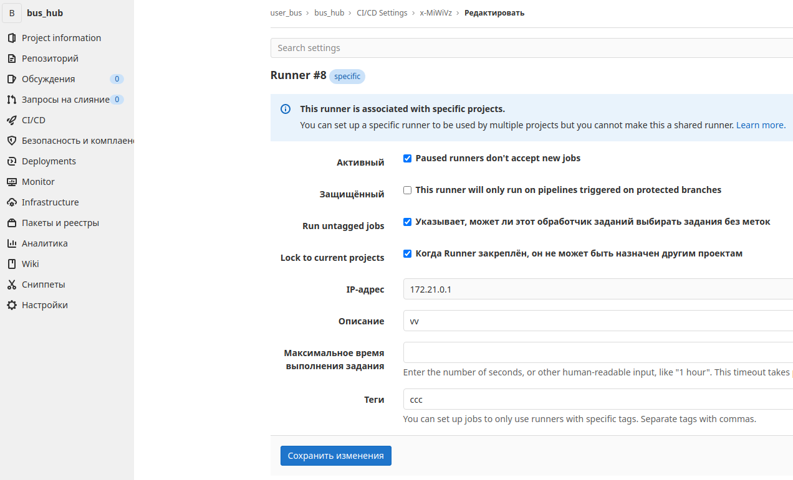

.. |br| raw:: html

    

GitLab
######

Рассматривается вариант развернутый с помощью Docker. Ниже будут представлены ссылки на официальные
инструкции и указаны особенности. Так же в разделе :ref:`gitlab-runner` указано как запустить GitLab вместе с CI/CD.
При развертывании системы где имеется **SELinux** необходимо дополнительно выполнить действия по ссылке 

.. attention::
   Если используется **SELinux** перед началом изучите пункт `docker selinux <https://docs.gitlab.com/runner/install/docker.html#selinux>`_
   и поправьте приложенные ниже конфигурации в соответсвии с инструкцией (добавив ``:Z`` к монтируемым томам)
   иначе получите ошибку о недоступном ``docker.sock``

Первичная настройка
*******************

Официальная инструкция расположена в разделе `docker <https://docs.gitlab.com/ee/install/docker.html>`_. Запустить
GitLab в Docker можно несколькими способами самый оптимальный с помощью ``docker-compose.yml`` (можно обойтись без compose
если нужно запустить GitLab без Runner и прочего, но лучше сразу написать файл ``docker-compose.yml``)
Конфигурирование происходит либо прямой правкой файла конфигурации ``/srv/gitlab/config/gitlab.rb`` (путь может отличаться)
либо при запуске контейнера с помощью переменной среды `подробнее <https://docs.gitlab.com/ee/install/docker.html#pre-configure-docker-container>`_. |br|

**На что необходимо обратить внимание:**

#. Подмена адреса в ``/etc/hosts`` |br|
   Если необходимо получить доступ к GitLab на локальной машине не по адресу `localhost <http://localhost/>`_.
   то необходимо добавить строку вида ``127.0.1.1  my.newdomen.com``
#. Правка парметра ``external_url...`` |br| 
   Для того что бы GitLab знал свой настоящий адрес (генерировал верные ссылки для клонирования, реистрации токенов и прочего)
   необходимо в файле конфигурации указать верный ``external_url``.

Резервное копирование
*********************

GitLab имеет встроенные средства позволяющие создавать и восстанавливать резервные копии настроек, репозиториев и т.д.
Можно перенести всю информацию с одной машины на другую `подробнее <https://docs.gitlab.com/ee/raketasks/backup_restore.html>`_ 

Создание копии
==============

#. Резервирование образа ``docker save -o /путь/до/места/хранения/image_gitlab.tar [имя контейнера или ID]``
#. Резервирование данных ``docker exec -it gitlab gitlab-backup create``

Файл данных контейнера будет находиться по пути: ``/srv/gitlab/data/backups`` и иметь вид ``1548856817_2021_08_30_14.2.1_gitlab_backup.tar``.

.. attention::
   Для переноса конфигурации на другую машину так же необходимы файлы: ``/srv/gitlab/config/gitlab-secrets.json`` и ``/srv/gitlab/config/gitlab.rb``

Восстановление копии
====================

Если цель перенести конфигурацию с одной машины на другую необходимо:

#. Положить файл с данными вида ``1548856817_2021_08_30_14.2.1_gitlab_backup.tar`` по пути ``/srv/gitlab/data/backups``
#. Положить файл ключа вида ``gitlab-secrets.json`` по пути ``/srv/gitlab/config/``
#. Восстановим образ Docker (если необходимо) ``docker load -i /путь/до/места/хранения/image_gitlab.tar``
#. Если контейнер работает, остановим процессы ``docker exec -it gitlab gitlab-ctl stop unicorn``, ``docker exec -it gitlab gitlab-ctl stop puma``, ``docker exec -it gitlab gitlab-ctl stop sidekiq``
#. Убедимся что процессы остановлены ``docker exec -it gitlab gitlab-ctl status``
#. Восстановим данные ``docker exec -it gitlab gitlab-backup restore BACKUP=1548856817_2021_08_30_14.2.1`` (см. примечание ниже)
#. Перезапустим контейнер ``docker restart gitlab``
#. Проверим ошибки ``docker exec -it gitlab gitlab-rake gitlab:check SANITIZE=true``

.. attention::
   При восстановлении данных с другой машины может возникнуть ошибка прав доступа для этого необходимо изменить владельца
   файла или **архивировать бэкап на той же машине где он был создан** тогда права не изменяться

.. _gitlab-runner:

Runner
******

Агент выполняющий задания CI/CD. Не входит в образ GitLab и устанавливается и настраивается отдельно. Есть два основных способа (запуск
в контейнере или отдельным приложением на хостовой машине). Предпочтительный способом через Docker, но и он же сложнее в организации.
Runner умеет выполнять задачи в различных окружениях. Основные это ``shell`` (выполняет задачу непосредственно на хостовой машине где установлен),
``docker`` (выполняет задачу в образе docker). Метод выбирается при регистрации runner либо прописывается в файле конфигурации
Ниже будет описан именно этот метод `подробнее о установке <https://docs.gitlab.com/runner/install/>`_.

.. attention::

   Если Runner работает в Docker с включенным кэш, то необходимо вручную очищать созданные контейнеры и разделы (volume) 
   иначе диск быстро забивается мусором! Скрипт можно найти в самом Runner по пути ``usr/share/gitlab-runner/clear-docker-cache``.
   Можно скопировать его и выполнять раз в какое то время (для справки запустить ``./clear-docker-cache help``)

Запуск
======

#. Необходимо написать файл запуска и настройки ``docker-compose.yml``. Рабочий пример представлен ниже :download:`Скачать <linux_files/gitlab/docker-compose.yml>` 

   .. literalinclude:: linux_files/gitlab/docker-compose.yml
     :language: yaml
   
   .. note::
      Так как GitLab и Runner два обособленных контейнера, но им необходимо обмениваться данными нужно организовать сеть между контейнерами.
      это реализует блок ``networks``. **Имя создаваемой сети зависит от каталога в котором запущен** ``docker-compose.yml``. Например если ``docker-compose.yml`` 
      лежит в каталоге  с именем ``git``, то создается сеть ``git_default`` Подробнее можно прочитать `тут <https://stackoverflow.com/questions/50325932/gitlab-runner-docker-could-not-resolve-host/>`_ 

#. Запустим контейнеры и сеть между ними (находясь в каталоге конфигурации) ``docker-compose up -d``

.. _gitlab-runner_settings:

Настройка
=========

Конфигурация runner храниться в файле ``/srv/gitlab-runner/config/config.toml`` (либо иное место если указан другой путь монтирования). 
Процесс конфигурации подразумевает регистрацию runner в Gitlab. Отредактировать конфигурацию (зарегистрировать) можно двумя способами `подробнее <https://docs.gitlab.com/runner/register/>`_ :

#. **Интерактивный режим** |br|
   Выполним ``docker exec -it gitlab_gitlab-runner_1 gitlab-runner register`` и следуем указаниям (для работоспособности все равно необходимо
   править конфигурацию вручную) этот метод может сформировать каркас конфигурации, но для runner запущенноо в Docker этого не достаточно
#. **Правка конфигурации** |br|
   Пример рабочей конфигурации ( `полное описание <https://docs.gitlab.com/runner/configuration/advanced-configuration.html>`_  ) :download:`Скачать <linux_files/gitlab/config.toml>` 

   .. literalinclude:: linux_files/gitlab/config.toml
     :language: yaml

   .. note::
      Значение строки ``network_mode =`` формируется из имени службы и имени указаном в ``docker-compose.yml``
      Например имя службы ``infrastructure``, имя сети ``backend`` тогда строка примет вид ``network_mode = "infrastructure_backend"``
      Для просмотра всех созданных сетей можно выполнить ``docker network ls``

   .. attention::
      Включение параметра ``privileged = true`` и ``volumes = ["/var/run/docker.sock:/var/run/docker.sock"...`` предоставляют
      Runner расширенные права доступа. Устанавливать только при необходимости (например при использование **Gitlab Registry**)

Если runner все же решено запускать отдельным приложением а GitLab запущен в Docker обратите внимание на следующее

#. Manjaro имеет в стандартном репозитории gitlab-runner
#. После установки для автозапуска необходимо включить сервис ``sudo systemctl enable gitlab-runner.service --now`` 
#. Файл конфигурации расположен ``/etc/gitlab-runner/config/config.toml``
#. Параметр ``network_mode =`` будет иметь вид ``network_mode = "host"``

Настройка SSL
*************
Для работы GitLab через протокол **https** необходимо:

#. Получить сертификат, его можно сгенерировать с помощью ``openssl``

   * Выполним команду генерации сертификата (должен содержать поле ``subjectAltName``):

     .. code-block:: bash
       :linenos:

       openssl req -newkey rsa:4096 -nodes -sha256 -keyout  ./server.key -x509 -days 3650 -out ./server.crt -addext "subjectAltName = DNS:git2.uonmap.com, DNS:uonmap.com, DNS:192.168.0.61"

       # ./server.key - имя для сгенерированного ключа
       # ./server.crt - имя самого сертификата
       # subjectAltName - поле необходимо для корректной авторизации клиентов в gitlab registry
       #                  тут прописываем все возможные домены ресурса

     .. note::
       при заполнении полей некоторые необходимо заполнять внимательно. Первое 
       поле ``Country Name`` код из двух символов например ``ru``. Очень важно верно заполнить
       поле ``Common Name (e.g. server FQDN or YOUR name)`` оно должно полностью соответствовать ``external_url`` (без ``https://``)
       например для конфигурации приведенной выше это будет ``gitlab_test.com``

     в результате нужно 2 файла ``server.key``, ``server.crt``
   * Отредактируем конфигурацию GitLab ``/srv/gitlab/config/gitlab.rb`` 
     (или можно добавить эти параметры на этапе создания контейнера) приводим поля к виду:

      .. code-block:: bash

         external_url 'https://gitlab_test.com'
         nginx['enable'] = true
         nginx['client_max_body_size'] = '250m'
         nginx['redirect_http_to_https'] = true
         nginx['ssl_certificate'] = "/etc/gitlab/server.crt"
         nginx['ssl_certificate_key'] = "/etc/gitlab/server.key"
         nginx['ssl_protocols'] = "TLSv1.2 TLSv1.3"

   * Обновим конфигурацию ``docker exec -it NAME_CONT gitlab-ctl reconfigure``
   
#. Настройка Runner

   Полученный сертификат ``server.crt`` копируем в каталог ``/srv/gitlab-runner/config``
   можно так же смонтировать каталог где находиться сертификат что бы все было в единичном экземпляре (более правильно)
   далее регистрируем Runner. Заходим в контейнер ``docker exec -it NAME_CONT bash`` выполняем 
   ``gitlab-runner register --tls-ca-file=/etc/gitlab-runner/server.crt`` после регистрации корректируем конфигурацию
   ``/srv/gitlab-runner/config/config.toml`` в соответсвии с рекомендациями :ref:`gitlab-runner_settings`

Registry
********

Для активации встроенного в GitLab движка **Registry** необходимо отредактировать конфигурацию GitLab ``/srv/gitlab/config/gitlab.rb`` 

.. code-block:: bash

   registry_external_url 'такой_же_как_и_external_url:5555' #например https://gitlab_test.com:5555
   registry_nginx['enable'] = true
   registry_nginx['listen_port'] = 5555

Так же необходимо пробростить указанный порт (5555) из контенера наружу (на хост) и 
на хосте в файле ``/etc/hosts`` прописать домен (например ``127.0.0.1 git2.uonmap.com``)
тогда можно попробовать залогиниться с хоста ``docker login git2.uonmap.com:5555``.
Ввести логин пароль от учетной записи GitLab

Для успешной авторизации с другой машины в сети на клиенте необходимо установить сертификат для Docker.
Копируем файл ``server.crt`` в каталог ``/etc/docker/certs.d/git2.uonmap.com:5555/ca.crt`` и переименовываем в ``ca.crt`` 
где ``git2.uonmap.com:5555`` адрес Registry на машину с которой хотим авторизоваться. 

.. attention::

   Если Registry работает в том же экземпляре (внутри GitLab) необходимо раз в какое то время удалять неиспользуемые слои и образы.
   Можно выполнить ``docker exec -it gitlab gitlab-ctl registry-garbage-collect -m`` `подробнее <https://docs.gitlab.com/ee/administration/packages/container_registry.html#removing-untagged-manifests-and-unreferenced-layers>`_
   По идеи эта команда должна удалить все лишнее из Registry, но почему то образы без тегов (временные слои видимо) остаются,
   можно выполнить еще ``docker rmi $(docker images -f "dangling=true" -q) --force`` это наверника удалит все образы без тегов

LDAP
****

ПОКА ТУТ ПУСТО

FAQ
***

Что делать если runner настроен, но GitLab все равно говорит об ожидании
========================================================================

По умолчанию параметр :guilabel:`Run untagged jobs`  по пути :menuselection:`Settings --> CI/CD --> Runner` (на выбранном runner кликнуть иконку карандаша)
отключен. Это значит если тег runner не совпадает с тегом репозитория, то runner не будет использован в этом репозитории. Можно 
отметить галочку, тогда теги будут игнорироваться

Как перевести в режим ReadOnly
==============================

Для перевода всего экземпляра GitLab необходимо отредактировать файл (путь указан внутри контейнера)
``/opt/gitlab/embedded/service/gitlab-rails/lib/gitlab/database.rb`` параметр ``def self.read_only``
выставить значение ``true``. Выполнить реконфигурацию ``gitlab-ctl reconfigure`` и перезапуск контейнера